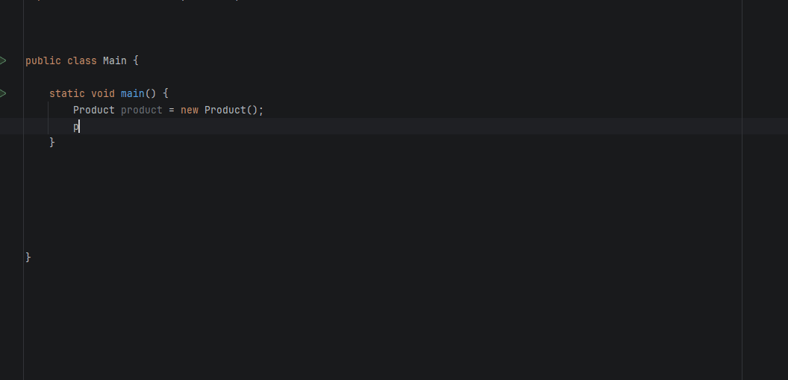

# LocalizedJPA IntelliJ IDEA Plugin

[](https://www.jetbrains.com/idea/)
[](https://openjdk.org/)
[](https://kotlinlang.org/)

IntelliJ IDEA plugin that provides full IDE support for the [LocalizedJPA](https://github.com/YasinSimsek99/localized-jpa) annotation processor library.

---

**🚀 [Install from JetBrains Marketplace](https://plugins.jetbrains.com/plugin/29551-localizedjpa)**

---

<p align="center">
  
</p>

---

## ✨ Features

### 🔧 Autocomplete Support
The plugin recognizes methods and fields injected by LocalizedJPA's annotation processor at compile-time:

```java
@LocalizedEntity
public class Product {
    @Localized
    private String name;
    
    @Localized
    private String description;
}
```

**Synthetic methods available in IDE:**
- `getName(Locale locale)` - Get localized name
- `setName(String value, Locale locale)` - Set localized name
- `getDescription(Locale locale)` - Get localized description
- `setDescription(String value, Locale locale)` - Set localized description

### 🔔 Smart Notifications
When a project containing LocalizedJPA is opened:
- Automatically detects the library in project dependencies
- Shows a notification to configure annotation processing
- Provides quick access to Annotation Processor settings
- "Don't Show Again" option to dismiss permanently

---

## 📦 Installation

### From JetBrains Marketplace (Recommended)
1. Open IntelliJ IDEA
2. Go to **Settings → Plugins → Marketplace**
3. Search for **"LocalizedJPA"**
4. Click **Install**
5. Restart IDE

### Manual Installation
1. Download the latest `LocalizedJpa-*.zip` from [GitHub Releases](https://github.com/YasinSimsek99/localized-jpa/releases)
2. Open IntelliJ IDEA
3. Go to **Settings → Plugins → ⚙️ (Settings icon) → Install Plugin from Disk...**
4. Select the downloaded ZIP file
5. Restart IDE

---

## 🚀 Usage

### 1. Add LocalizedJPA to Your Project

See the [LocalizedJPA documentation](https://github.com/YasinSimsek99/localized-jpa) for installation and configuration instructions.

### 2. Enable Annotation Processing
Go to **Settings → Build, Execution, Deployment → Compiler → Annotation Processors**
- ✅ Enable annotation processing
- ✅ Obtain processors from project classpath

### 3. Use the Annotations
```java
import com.localizedjpa.annotations.LocalizedEntity;
import com.localizedjpa.annotations.Localized;

@LocalizedEntity
@Entity
public class Product {
    @Id
    private Long id;
    
    @Localized
    private String name;
    
    // IDE now recognizes:
    // - getName(Locale locale)
    // - setName(String value, Locale locale)
}
```

### 4. Enjoy Full IDE Support
```java
Product product = new Product();
product.setName("Laptop", Locale.ENGLISH);      // ✅ Autocomplete works!
product.setName("Dizüstü", new Locale("tr"));   // ✅ No red underlines!
String name = product.getName(Locale.ENGLISH);  // ✅ Recognized by IDE!
```

---

## 🛠️ Development

### Prerequisites
- JDK 17+
- IntelliJ IDEA 2025.2+
- Gradle 9.0+

### Build
```bash
./gradlew build
```

### Run in Sandbox IDE
```bash
./gradlew runIde
```

### Create Distribution
```bash
./gradlew buildPlugin
```
Output: `build/distributions/LocalizedJpa-*.zip`

---

## 🏗️ Architecture

```
src/main/kotlin/com/localizedjpa/intellij/
├── LocalizedJpaPsiAugmentProvider.kt   # PSI augmentation for synthetic methods
└── LocalizedJpaStartupActivity.kt      # Startup notification for AP config
```

### Key Components

#### PsiAugmentProvider
Extends IntelliJ's `PsiAugmentProvider` to inject synthetic PSI elements:
- Scans for `@LocalizedEntity` annotated classes
- Uses caching for performance

#### StartupActivity
Implements `ProjectActivity` to detect LocalizedJPA:
- Checks project dependencies on startup
- Shows notification if library is found
- Provides quick settings access
- Persists user preferences

---

## 📋 Compatibility

| IntelliJ IDEA | Plugin Version |
|---------------|----------------|
| 2025.2+       | 0.1.1+         |

---

## 🤝 Contributing

Contributions are welcome! Please feel free to submit a Pull Request.

1. Fork the repository
2. Create your feature branch (`git checkout -b feature/amazing-feature`)
3. Commit your changes (`git commit -m 'Add amazing feature'`)
4. Push to the branch (`git push origin feature/amazing-feature`)
5. Open a Pull Request

---

## 📄 License

This project is licensed under the GNU General Public License v3.0 - see the [LICENSE](LICENSE) file for details.

---

## 🔗 Links

- [LocalizedJPA Library](https://github.com/YasinSimsek99/localized-jpa)
- [JetBrains Marketplace](https://plugins.jetbrains.com/)
- [IntelliJ Platform SDK](https://plugins.jetbrains.com/docs/intellij/welcome.html)

---

## 📧 Contact

- **Author:** Yasin Şimşek
- **Email:** yasinsimsekk67@gmail.com
- **GitHub:** [@YasinSimsek99](https://github.com/YasinSimsek99)